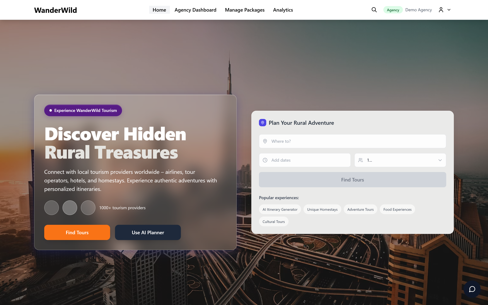
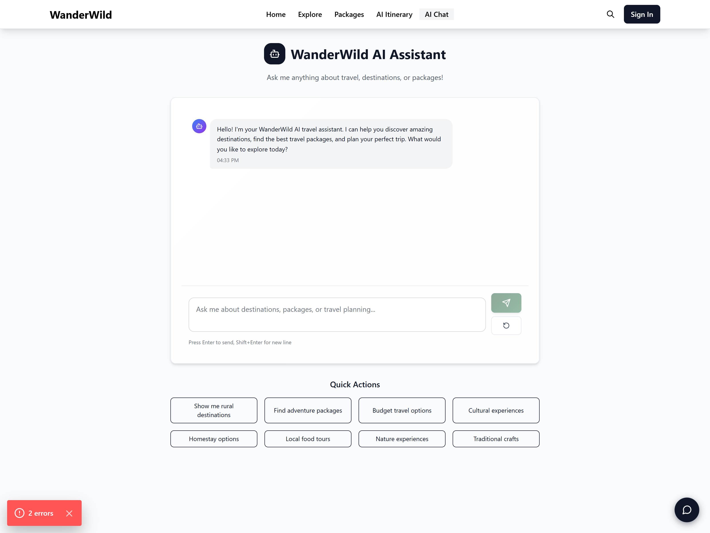
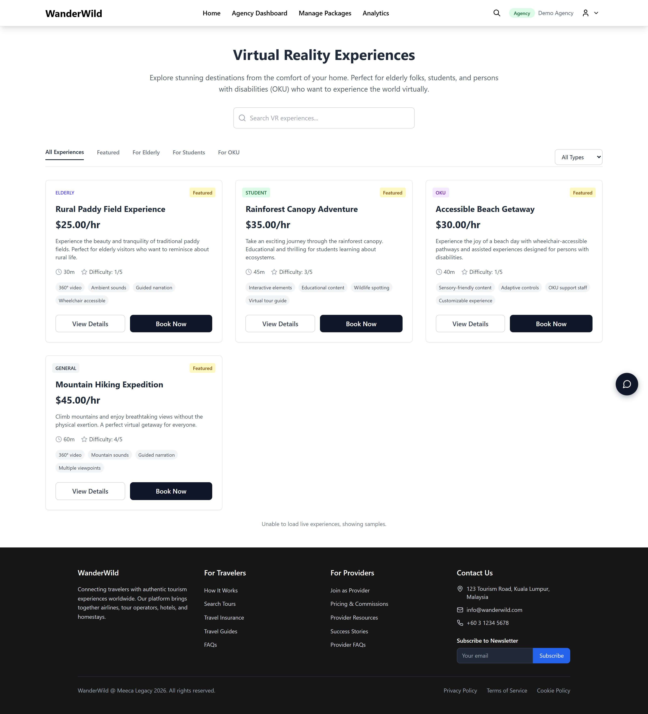
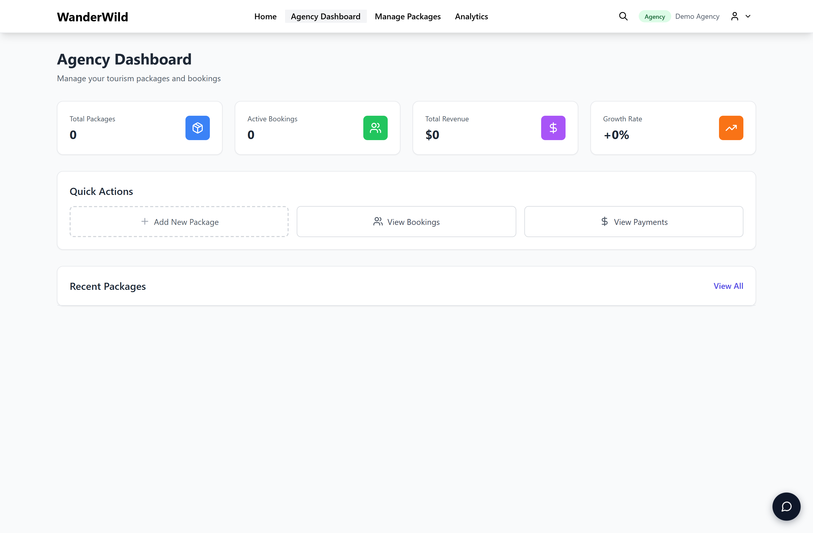
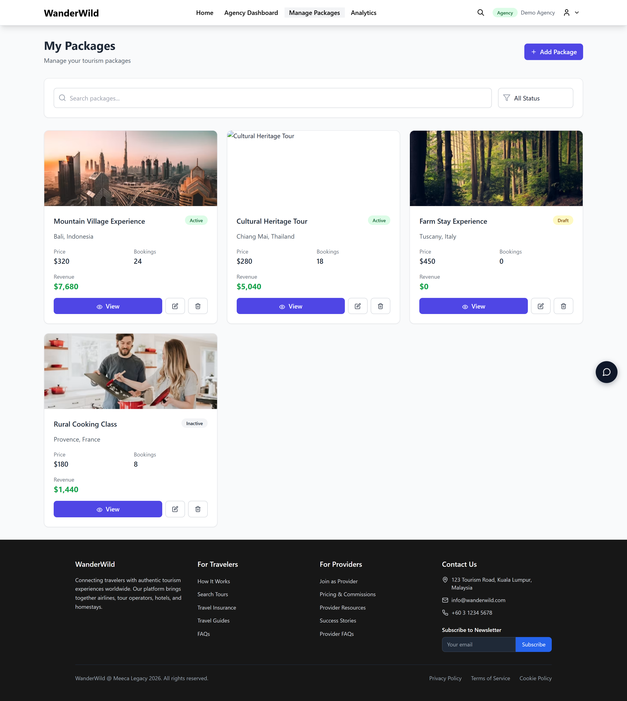

# WanderWild 🌿 (Co-Devlopment In Progress)

**Discover Hidden Rural Treasures** — a full-stack travel platform that connects travellers with local rural tourism providers (airlines, tour operators, hotels and homestays), featuring an AI travel assistant, AI itinerary generation and inclusive Virtual Reality experiences.

## Repository structure

```
WanderWild/
├── frontend/             # Next.js 14 + TypeScript + Tailwind app (UI)
├── WanderWild_Backend/   # Node.js + Express + Supabase REST API
├── screenshots/          # UI screenshots of the implemented pages
└── screenshot.js         # Puppeteer script used to capture the screenshots
```

## Tech stack

| Layer    | Technologies |
|----------|--------------|
| Frontend | Next.js 14 (App Router), React 18, TypeScript, Tailwind CSS, Zustand, Framer Motion, Axios |
| Backend  | Node.js, Express, Supabase (PostgreSQL), JWT auth, OpenAI |

## Features

- 🔐 Multi-role auth (Customer / Agency / Admin) with role-based dashboards
- 🧭 Package discovery, filtering and detail pages
- 🤖 AI travel chatbot and AI itinerary generator (OpenAI, with graceful fallbacks)
- 🕶️ Inclusive Virtual Reality experiences (designed for elderly, students and persons with disabilities)
- 📊 Analytics dashboards for agencies and admins
- 💬 Inquiry / messaging system and booking flow

## Getting started

### Backend
```bash
cd WanderWild_Backend
npm install
cp env.example .env        # then fill in your Supabase / JWT / OpenAI values
npm run dev                # http://localhost:5000
```

### Frontend
```bash
cd frontend
npm install
npm run dev                # http://localhost:3000
```

The frontend reads the API base URL from `frontend/.env.local`:
```
NEXT_PUBLIC_API_URL=http://localhost:5000/api
```

> **Note:** the backend requires a configured Supabase project (see `WanderWild_Backend/env.example`). When the database is unavailable, the frontend gracefully falls back to bundled sample data so the UI remains fully browsable.

## Screenshots

### Home


### AI Travel Assistant (Chatbot)


### Virtual Reality Experiences


### Agency Dashboard


### Manage Packages


## License

MIT
